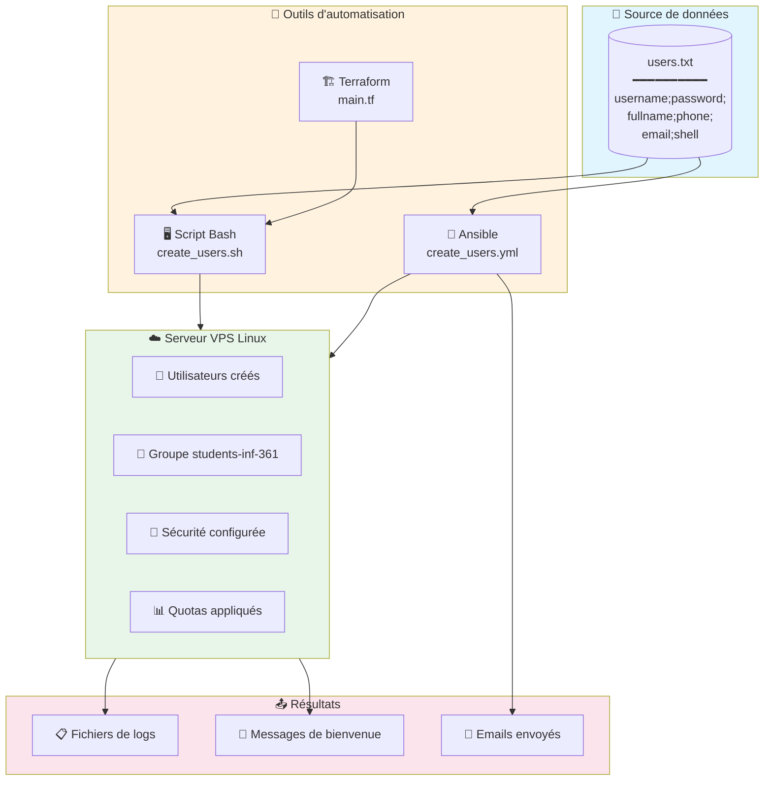
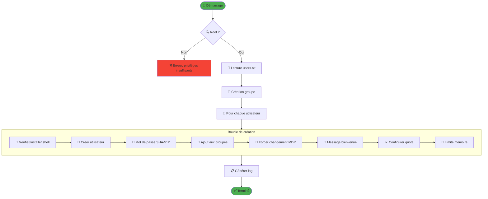
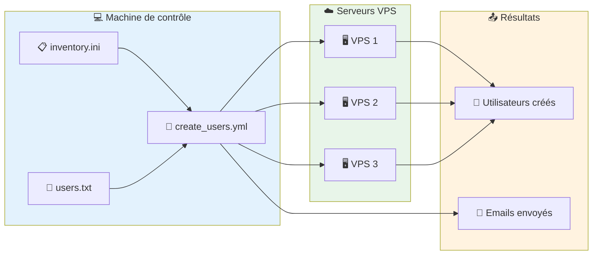
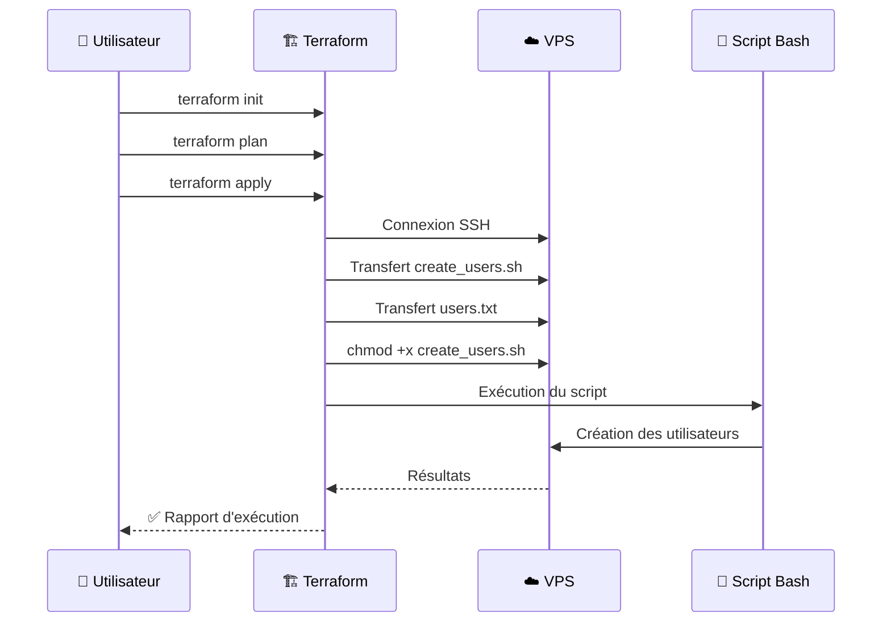
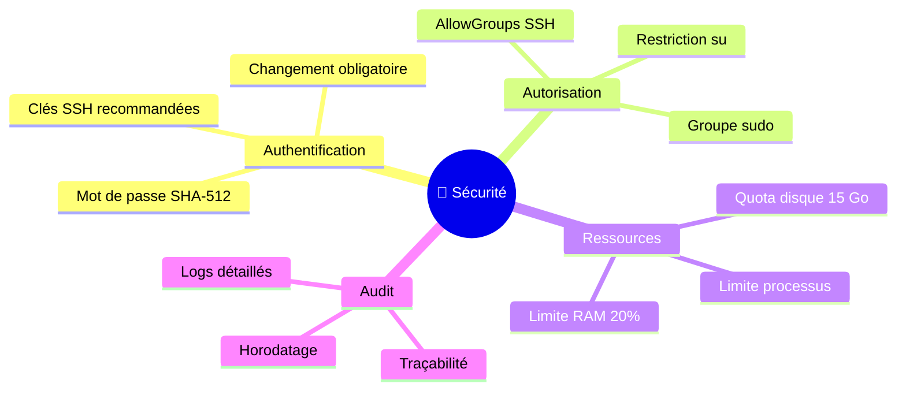

<<<<<<< HEAD
# Secure_vps
Comment securiser son VPS de facon  complete avec un script bash une playbook ansible ou terraform
=======
<div align="center">

# 🖥️ TP1 - Automatisation de la Création d'Utilisateurs Linux


[](https://github.com/votre-username)
[](https://www.uy1.uninet.cm/)
[](#)

**Administration Systèmes et Réseaux - Université de Yaoundé I**

---

### 👨‍🎓 Informations de l'étudiant

| Champ | Valeur |
|:------|:-------|
| **Nom complet** | AZAB A RANGA FRANCK MIGUEL |
| **Matricule** | 23V2227 |
| **Filière** | Informatique - Licence 3 |
| **Cours** | INF 3611 |
| **Date** | 01 Décembre 2025 |

</div>

---

## 📋 Table des matières

- [🎯 Objectif du projet](#-objectif-du-projet)
- [🏗️ Architecture du projet](#️-architecture-du-projet)
- [📁 Structure des fichiers](#-structure-des-fichiers)
- [🔧 Prérequis](#-prérequis)
- [📖 Partie 0 : Sécurité SSH](#-partie-0--sécurité-ssh)
- [💻 Partie 1 : Script Bash](#-partie-1--script-bash)
- [🤖 Partie 2 : Playbook Ansible](#-partie-2--playbook-ansible)
- [🏗️ Partie 3 : Terraform](#️-partie-3--terraform)
- [📄 Format du fichier users.txt](#-format-du-fichier-userstxt)
- [🚀 Guide de démarrage rapide](#-guide-de-démarrage-rapide)
- [📊 Fonctionnalités implémentées](#-fonctionnalités-implémentées)
- [🔐 Sécurité](#-sécurité)
- [📝 Licence](#-licence)

---

## 🎯 Objectif du projet

Ce projet automatise la création de comptes utilisateurs sur un VPS Linux, permettant de :

- ✅ Créer automatiquement des utilisateurs depuis un fichier `users.txt`
- ✅ Configurer les shells, mots de passe et répertoires personnels
- ✅ Appliquer des quotas disque et limites mémoire
- ✅ Renforcer la sécurité SSH du serveur
- ✅ Envoyer des emails de bienvenue automatiques

---

## 🏗️ Architecture du projet



---

## 📁 Structure des fichiers

```
📦 TP-INF3611-Securite-VPS/
├── 📄 README.md                          # Documentation principale
├── 📄 .gitignore                         # Fichiers ignorés par Git
│
├── 📂 Partie0-SSH/                       # Documentation sécurité SSH
│   └── 📄 README.md                      # Procédures et paramètres
│
├── 📂 Partie1-Bash/                      # Script Bash
│   ├── 📄 README.md                      # Documentation du script
│   ├── 📄 create_users.sh                # Script principal
│   └── 📄 users.txt                      # Fichier source utilisateurs
│
├── 📂 Partie2-Ansible/                   # Playbook Ansible
│   ├── 📄 README.md                      # Documentation Ansible
│   ├── 📄 create_users.yml               # Playbook principal
│   ├── 📄 inventory.ini                  # Inventaire des serveurs
│   ├── 📄 ansible.cfg                    # Configuration Ansible
│   ├── 📄 users.txt                      # Fichier source utilisateurs
│   ├── 📄 users.yml                      # Variables (optionnel)
│   └── 📂 templates/
│       └── 📄 welcome.txt.j2             # Template message bienvenue
│
├── 📂 Partie3-Terraform/                 # Infrastructure as Code
│   ├── 📄 README.md                      # Documentation Terraform
│   ├── 📄 main.tf                        # Configuration principale
│   ├── 📄 variables.tf                   # Définition des variables
│   ├── 📄 outputs.tf                     # Sorties Terraform
│   └── 📄 terraform.tfvars.example       # Exemple de configuration
│
└── 📂 docs/                              # Documentation supplémentaire
    └── 📂 images/                        # Images et diagrammes
```

---

## 🔧 Prérequis

### Système
- 🐧 Linux (Ubuntu 20.04+ / Debian 11+ recommandé)
- 🔑 Accès root ou sudo

### Outils requis

| Outil | Version | Installation |
|-------|---------|--------------|
| Git | 2.x+ | `sudo apt install git` |
| Bash | 4.x+ | Pré-installé |
| Ansible | 2.9+ | `sudo apt install ansible` |
| Terraform | 1.0+ | [Instructions](#installation-terraform) |

### Installation Terraform

```bash
# Ubuntu/Debian
wget -O- https://apt.releases.hashicorp.com/gpg | sudo gpg --dearmor -o /usr/share/keyrings/hashicorp-archive-keyring.gpg
echo "deb [signed-by=/usr/share/keyrings/hashicorp-archive-keyring.gpg] https://apt.releases.hashicorp.com $(lsb_release -cs) main" | sudo tee /etc/apt/sources.list.d/hashicorp.list
sudo apt update && sudo apt install terraform
```

---

## 📖 Partie 0 : Sécurité SSH

### Procédure de modification SSH


### ⚠️ Risque principal

> **Lock-out du serveur** : Si la procédure n'est pas respectée, vous risquez de perdre totalement l'accès SSH au serveur !

### 🔐 5 Paramètres de sécurité essentiels

| # | Paramètre | Valeur | Justification |
|:-:|-----------|--------|---------------|
| 1 | `PermitRootLogin` | `no` | 🚫 Empêche la connexion directe en root |
| 2 | `Port` | `2222` | 🔀 Réduit les scans automatisés sur le port 22 |
| 3 | `PasswordAuthentication` | `no` | 🔑 Force l'authentification par clé SSH |
| 4 | `MaxAuthTries` | `3` | ⏱️ Limite les tentatives de connexion |
| 5 | `AllowGroups` | `students-inf-361` | 👥 Restreint l'accès à un groupe spécifique |

📖 **Documentation complète** : [`Partie0-SSH/README.md`](./Partie0-SSH/README.md)

---

## 💻 Partie 1 : Script Bash

### Flux d'exécution



### Utilisation

```bash
# Se placer dans le répertoire
cd Partie1-Bash

# Rendre le script exécutable
chmod +x create_users.sh

# Exécuter avec le nom du groupe
sudo ./create_users.sh students-inf-361

# Avec un fichier personnalisé
sudo ./create_users.sh students-inf-361 /chemin/vers/mes_users.txt
```

### Exemple de sortie

```
================================================================================
   SCRIPT DE CRÉATION D'UTILISATEURS - INF 3611
   Auteur: AZAB A RANGA FRANCK MIGUEL - 23V2227
================================================================================
[INFO] Création du groupe 'students-inf-361'...
[SUCCESS] Groupe 'students-inf-361' créé avec succès.
[INFO] Création de l'utilisateur: jean.dupont
[SUCCESS] Utilisateur 'jean.dupont' créé avec le shell '/bin/bash'.
[SUCCESS] Mot de passe haché SHA-512 configuré.
[SUCCESS] Changement de mot de passe obligatoire à la première connexion.
...
================================================================================
SCRIPT TERMINÉ AVEC SUCCÈS
================================================================================
```

📖 **Documentation complète** : [`Partie1-Bash/README.md`](./Partie1-Bash/README.md)

---

## 🤖 Partie 2 : Playbook Ansible

### Architecture



### Utilisation

```bash
# Se placer dans le répertoire
cd Partie2-Ansible

# Configurer l'inventaire
nano inventory.ini

# Vérifier la connectivité
ansible -i inventory.ini all -m ping

# Exécuter le playbook
ansible-playbook -i inventory.ini create_users.yml
```

### 📧 Contenu de l'email envoyé

Chaque utilisateur reçoit un email contenant :

```
═══════════════════════════════════════════════════════════════
                  INFORMATIONS DE CONNEXION
═══════════════════════════════════════════════════════════════

📍 Adresse IP du serveur : 192.168.1.100
🔌 Port SSH              : 22
👤 Nom d'utilisateur     : jean.dupont
🔑 Mot de passe initial  : TempPass123!

💻 Commande SSH pour se connecter :
   ssh jean.dupont@192.168.1.100 -p 22

🔐 Commande pour transmettre votre clé publique SSH :
   • Linux/macOS : ssh-copy-id jean.dupont@192.168.1.100
   • Windows     : type %USERPROFILE%\.ssh\id_rsa.pub | ssh ...
```

📖 **Documentation complète** : [`Partie2-Ansible/README.md`](./Partie2-Ansible/README.md)

---

## 🏗️ Partie 3 : Terraform

### Workflow



### Utilisation

```bash
# Se placer dans le répertoire
cd Partie3-Terraform

# Créer le fichier de configuration
cp terraform.tfvars.example terraform.tfvars
nano terraform.tfvars

# Initialiser Terraform
terraform init

# Prévisualiser les changements
terraform plan

# Appliquer la configuration
terraform apply
```

### Variables à configurer

| Variable | Description | Exemple |
|----------|-------------|---------|
| `server_ip` | IP du VPS | `192.168.1.100` |
| `ssh_user` | Utilisateur SSH | `admin` |
| `ssh_port` | Port SSH | `22` |
| `group_name` | Nom du groupe | `students-inf-361` |

📖 **Documentation complète** : [`Partie3-Terraform/README.md`](./Partie3-Terraform/README.md)

---

## 📄 Format du fichier users.txt

### Structure

```
username;default_password;full_name;phone;email;preferred_shell
```

### Exemple

```bash
# Fichier users.txt - Exemple
# Les lignes commençant par # sont ignorées

jean.dupont;TempPass123!;Jean Dupont;+237699001122;jean.dupont@univ-yaounde1.cm;/bin/bash
marie.kamga;SecureP@ss456;Marie Kamga;+237677889900;marie.kamga@univ-yaounde1.cm;/bin/zsh
paul.nguema;MyP@ssw0rd789;Paul Nguema;+237655443322;paul.nguema@univ-yaounde1.cm;/bin/bash
alice.mbarga;Str0ngP@ss!;Alice Mbarga;+237690112233;alice.mbarga@univ-yaounde1.cm;/bin/bash
bob.fouda;P@ssw0rd2025;Bob Fouda;+237688776655;bob.fouda@univ-yaounde1.cm;/usr/bin/fish
```

### Champs

| Champ | Description | Obligatoire |
|-------|-------------|:-----------:|
| `username` | Nom d'utilisateur Linux | ✅ |
| `default_password` | Mot de passe initial | ✅ |
| `full_name` | Nom complet | ✅ |
| `phone` | Numéro WhatsApp | ✅ |
| `email` | Adresse email | ✅ |
| `preferred_shell` | Shell préféré (`/bin/bash`, `/bin/zsh`, etc.) | ✅ |

---

## 🚀 Guide de démarrage rapide

### Option 1 : Script Bash (Local)

```bash
git clone https://github.com/VOTRE_USERNAME/TP-INF3611-Securite-VPS.git
cd TP-INF3611-Securite-VPS/Partie1-Bash
chmod +x create_users.sh
sudo ./create_users.sh students-inf-361 users.txt
```

### Option 2 : Ansible (Distant)

```bash
git clone https://github.com/VOTRE_USERNAME/TP-INF3611-Securite-VPS.git
cd TP-INF3611-Securite-VPS/Partie2-Ansible
# Modifier inventory.ini avec votre IP VPS
ansible-playbook -i inventory.ini create_users.yml
```

### Option 3 : Terraform (Infrastructure as Code)

```bash
git clone https://github.com/VOTRE_USERNAME/TP-INF3611-Securite-VPS.git
cd TP-INF3611-Securite-VPS/Partie3-Terraform
cp terraform.tfvars.example terraform.tfvars
# Modifier terraform.tfvars avec vos paramètres
terraform init && terraform apply
```

---

## 📊 Fonctionnalités implémentées

### Tableau récapitulatif

| # | Fonctionnalité | Bash | Ansible | Terraform |
|:-:|----------------|:----:|:-------:|:---------:|
| 1 | Création groupe (paramètre) | ✅ | ✅ | ✅ |
| 2 | Création utilisateur complet | ✅ | ✅ | ✅ |
| 3 | Vérification/installation shell | ✅ | ✅ | ✅ |
| 4 | Mot de passe SHA-512 | ✅ | ✅ | ✅ |
| 5 | Changement MDP obligatoire | ✅ | ✅ | ✅ |
| 6 | Groupe sudo + restriction 'su' | ✅ | ✅ | ✅ |
| 7 | Message de bienvenue | ✅ | ✅ | ✅ |
| 8 | Quota disque 15 Go | ✅ | ✅ | ✅ |
| 9 | Limite mémoire 20% RAM | ✅ | ✅ | ✅ |
| 10 | Fichier de logs | ✅ | ✅ | ✅ |
| 11 | Envoi d'email | ❌ | ✅ | ❌ |
| 12 | Chargement depuis users.txt | ✅ | ✅ | ✅ |

---

## 🔐 Sécurité

### Bonnes pratiques implémentées



### ⚠️ Fichiers à ne jamais commiter

```gitignore
# Secrets
*.tfvars
secrets.yml
vault.yml

# États
*.tfstate
*.tfstate.backup
.terraform/

# Clés SSH
id_rsa*
*.pem
*.key
```

---

## 🛠️ Compétences développées

| Compétence | Partie |
|------------|:------:|
| 📝 Scripts Bash robustes | 1 |
| 👥 Gestion utilisateurs/groupes Linux | 1, 2 |
| 🔐 Permissions et restrictions | 0, 1, 2 |
| 🔒 Configuration SSH sécurisée | 0 |
| 📊 Gestion ressources système | 1, 2 |
| 🎨 Personnalisation environnement | 1, 2 |
| 🤖 Industrialisation avec Ansible | 2 |
| 📧 Envoi automatique d'emails | 2 |
| 🏗️ Infrastructure as Code (Terraform) | 3 |
| 📚 Documentation technique | Toutes |

---

## 📝 Licence

Ce projet est réalisé dans le cadre du cours **INF 3611 - Administration Systèmes et Réseaux** à l'Université de Yaoundé I.

---

<div align="center">

### 🙏 Remerciements

Un grand merci à **M. NGOUANFO** pour son enseignement et son encadrement.

---

**Université de Yaoundé I - Faculté des Sciences**  
**Département d'Informatique - Licence 3**  
**Année académique 2024-2025**

---


</div>
>>>>>>> 0d8aafe (feat: README complet avec diagrammes Mermaid + Ansible charge users.txt)
